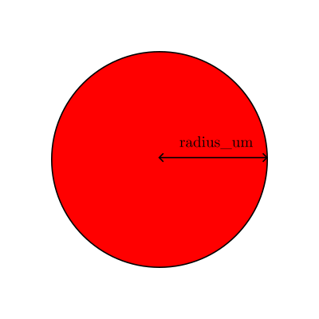
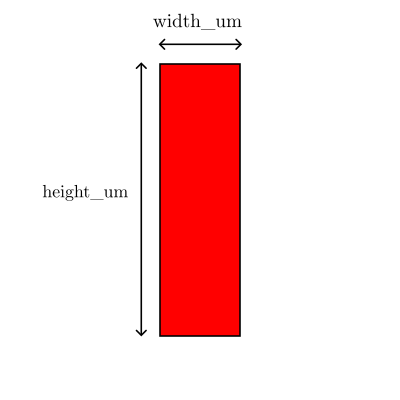
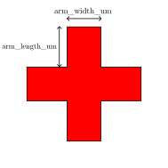

# MetaHan

MetaHan is a Python toolkit for metasurface layout generation and GDSII export.
It provides reusable unit-cell geometry, lattice placement, aperture filtering,
and a config-driven flow to build multi-cell GDS layouts.

## Current status

The core library under `src/metahan/` is implemented and usable.
Several scaffold files (CLI/scripts/docs) are still placeholders.

## Features

- Unit cells:
  - `CircleCell`
  - `SquareCell`
  - `RectangleCell`
  - `EllipseCell`
  - `TriangleCell`
  - `CrossCell`
  - `SuperCell` (composed from multiple child unit cells + offsets)
- Apertures:
  - `RectangleAperture`
  - `CircleAperture`
  - `SquareAperture`
- Lattice generation:
  - square lattice
  - hexagonal lattice
- Builder pipeline:
  - generate lattice positions
  - aperture filtering
  - optional rotation/translation
  - polygon generation via `gdstk`
- Config pipeline:
  - load YAML layout config
  - generate a hierarchical layout: `TOP -> GROUP_* -> METASURFACE_*`
  - assign `layer/datatype` per group
  - export `.gds`

## Requirements

- Python 3.9+
- `gdstk`
- `numpy`
- `pyyaml`

Optional (for local development):
- `pytest`

## Setup

```bash
python -m venv .venv
.venv\Scripts\activate
pip install -e ".[dev]"
```

This installs the local package in editable mode and exposes the CLI command:

```bash
metahan --config configs/layout.yaml
```

If you want to import `metahan` directly from source without packaging, set:

```bash
set PYTHONPATH=src
```

On PowerShell:

```powershell
$env:PYTHONPATH = "src"
```

## Quick start (Python API)

```python
from pathlib import Path

import gdstk

from metahan.apertures.rectangle import RectangleAperture
from metahan.core.builder import MetasurfaceBuilder
from metahan.core.lattice import Lattice
from metahan.core.metasurface import MetasurfaceSpec
from metahan.unit_cells.circle import CircleCell

spec = MetasurfaceSpec(
    name="MS_CIRCLE",
    unit_cell=CircleCell(radius_um=0.12),
    lattice=Lattice(pitch=0.8),
    nx=200,
    ny=200,
    lattice_kind="square",
    center=(0.0, 0.0),
    rotation_deg=0.0,
    aperture=RectangleAperture(width=80, height=80),
)

polygons = MetasurfaceBuilder([spec]).build()

lib = gdstk.Library()
cell = gdstk.Cell("MS_CIRCLE")
cell.add(*polygons)
lib.add(cell)

out_dir = Path("output")
out_dir.mkdir(parents=True, exist_ok=True)
lib.write_gds(str(out_dir / "layout.gds"))
```

## Quick start (YAML config)

Example: `configs/layout.yaml`

```yaml
output:
  file: output/layout.gds

top_cells:
  - name: METASURFACE_MEASURABLE
    layer: 1
    datatype: 0
    metasurfaces:
      - name: METASURFACE_W_100
        origin: [0, 0]
        unit_cell:
          type: supercell
          cells:
            - type: circle
              radius_um: 0.25
              offset: [0.0, 0.0]
            - type: circle
              radius_um: 0.10
              offset: [0.5, 0.5]
        lattice:
          kind: square
          pitch: 1.5
          nx: 200
          ny: 200
        aperture:
          type: rectangle
          width: 100
          height: 100
  - name: METASURFACE_DOSE_TEST
    layer: 2
    datatype: 0
    metasurfaces:
      - name: METASURFACE_D_100
        origin: [-1000, -100]
        unit_cell: { type: circle, radius_um: 0.10 }
        lattice: { kind: square, pitch: 1.0, nx: 100, ny: 100 }
```

Run it with the CLI:

```bash
metahan --config configs/layout.yaml
```

Or from Python:

```python
from metahan import build_layout

layout = build_layout("configs/layout.yaml")
layout.plot()        # lightweight point preview
layout.show()        # writes a temporary GDS and opens it with the system viewer
path = layout.write_gds("output/layout.gds")
print(path)
```

## YAML reference

The layout config is organized like this:

```text
output
top_cells[]
  name
  layer
  datatype
  metasurfaces[]
    name
    origin
    unit_cell
    lattice or positions
    center
    rotation_deg
    aperture
```

Commented example:

```yaml
output:
  file: output/layout.gds   # Output GDS path

top_cells:
  - name: METASURFACE_MEASURABLE   # Group name; exported as GROUP_METASURFACE_MEASURABLE under TOP
    layer: 1                       # All polygons in this group are written on layer 1
    datatype: 0                    # Optional sub-category inside the layer
    metasurfaces:
      - name: METASURFACE_W_100    # Cell name of this metasurface
        origin: [0, 0]             # Where this metasurface is placed inside its group cell

        unit_cell:                 # Repeated geometry placed on each lattice position
          type: circle
          radius_um: 0.15

        lattice:                   # Regular grid generation
          kind: square             # square or hexagonal
          pitch: 1.5               # Spacing between neighbor lattice positions, in um
          nx: 200                  # Number of columns
          ny: 200                  # Number of rows

        # Alternative to lattice:
        # positions:
        #   - [0.0, 0.0]
        #   - [1.5, 0.0]
        #   - [3.0, 0.0]

        center: [0.0, 0.0]         # Final translation applied to the metasurface geometry
        rotation_deg: 0.0          # Final rotation applied to the metasurface geometry

        aperture:                  # Optional clipping/filtering region
          type: rectangle
          width: 100
          height: 100
```

Field meanings:

- `output.file`: output `.gds` path.
- `top_cells`: logical groups. The writer exports one root `TOP`, then one `GROUP_<name>` per entry.
- `top_cells[].layer` / `top_cells[].datatype`: applied to every polygon generated in that group.
- `metasurfaces[].origin`: placement of that metasurface inside its group cell.
- `metasurfaces[].center`: translation applied to the generated pattern before `origin`.
- `metasurfaces[].rotation_deg`: rotation applied to the generated pattern before `origin`.
- `metasurfaces[].lattice`: use this for a regular array.
- `metasurfaces[].positions`: use this instead of `lattice` if you want explicit custom coordinates.

Supported `unit_cell` types:
  
- `circle`
  Example:
  ```yaml
  unit_cell:
    type: circle
    radius_um: 0.15
  ```
- `square`
  Example:
  ```yaml
  unit_cell:
    type: square
    side_um: 0.30
  ```
- `rectangle`
  Example:
  ```yaml
  unit_cell:
    type: rectangle
    width_um: 0.40
    height_um: 0.20
  ```
  
- `ellipse`
  Example:
  ```yaml
  unit_cell:
    type: ellipse
    radius_x_um: 0.25
    radius_y_um: 0.10
  ```
- `triangle`
  Example:
  ```yaml
  unit_cell:
    type: triangle
    side_um: 0.30
  ```
- `cross`
  Example:
  ```yaml
  unit_cell:
    type: cross
    arm_length_um: 0.40
    arm_width_um: 0.12
  ```
  
- `supercell`
  Example:
  ```yaml
  unit_cell:
    type: supercell
    cells:
      - type: circle
        radius_um: 0.20
        offset: [0.0, 0.0]
      - type: rectangle
        width_um: 0.30
        height_um: 0.10
        offset: [0.5, 0.0]
  ```
  Notes:
  Each child entry uses the same schema as a normal `unit_cell`, plus `offset: [x, y]`.

Supported `lattice.kind` values:

- `square`
- `hexagonal`

Supported `aperture` types:

- `rectangle`
  ```yaml
  aperture:
    type: rectangle
    width: 100
    height: 80
  ```
- `square`
  ```yaml
  aperture:
    type: square
    side: 100
  ```
- `circle`
  ```yaml
  aperture:
    type: circle
    radius: 50
  ```

Rules to keep in mind:

- Use either `lattice` or `positions`, not both.
- If you use `lattice`, you must provide `pitch`, `nx`, and `ny`.
- `center`, `origin`, offsets, pitch, and aperture dimensions are interpreted in micrometers.
- `layer` and `datatype` are defined at the group level in the current YAML schema.

## Configuration notes

- `unit_cell.type` currently supports:
  - `circle`, `square`, `rectangle`, `ellipse`, `triangle`, `cross`, `supercell`
- `aperture.type` currently supports:
  - `rectangle`, `circle`, `square`
- Each entry under `top_cells` becomes a group cell under `TOP`
  and is exported as `GROUP_<name>`
- `layer` and `datatype` can be set per group to make categories easy to
  hide/show in KLayout
- In `MetasurfaceSpec`, provide either:
  - explicit `positions`, or
  - `lattice` + `nx` + `ny`

## Project layout

- `src/metahan/`: library code
- `configs/`: YAML examples/configurations
- `tests/`: test files
- `output/`: generated artifacts

## Testing

```bash
pytest -q
```

Note: some test files are currently script-style and may generate GDS outputs under
`output/test`.

## License

MIT. See [LICENSE](LICENSE).
